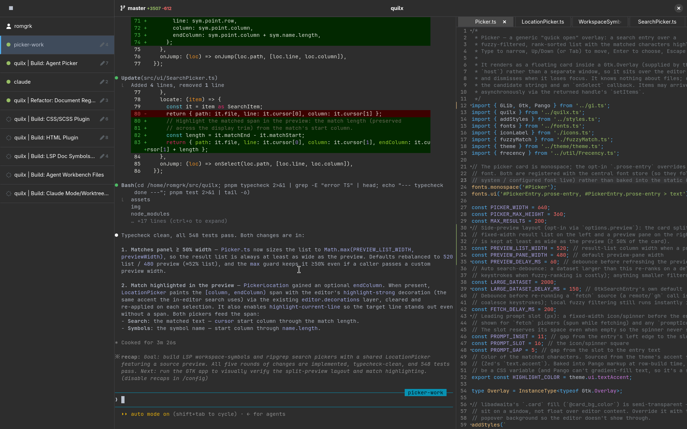

# quilx

A modal source-code editor built with [GtkSourceView 5](https://gitlab.gnome.org/GNOME/gtksourceview),
GTK 4 and [Adwaita](https://gnome.pages.gitlab.gnome.org/libadwaita/), running on
[node-gtk](https://github.com/romgrk/node-gtk).



## Features

- **Vim-style modal editing** via `GtkSource.VimIMContext`, with a status line
  showing the command bar (`:`, `/`) and pending command preview (e.g. `2dw`)
- Syntax highlighting with automatic language detection
- Adwaita light/dark style schemes that follow the system preference, plus a
  toolbar toggle to force dark mode
- Open / Save / Save-As through the native `Gtk.FileDialog`
- A source-map (minimap) gutter on the right
- A `Space`-leader keybinding scheme, plus `Ctrl+*` shortcuts and Vim-style
  window splits — see [Keybindings](#keybindings)
- Notifications surfaced as transient toasts and kept in a persistent log panel
  — see [Notifications](#notifications)
- Terminal-based coding **agents** embedded in the workbench, with a live status
  list and a quick-switcher — see [Agents](#agents)

## Requirements

- Node.js and [pnpm](https://pnpm.io)
- GTK 4, libadwaita, and GtkSourceView 5 with their GObject-Introspection
  typelibs installed (`Gtk-4.0`, `Adw-1`, `GtkSource-5`)

## Setup

`node-gtk` is consumed as a local linked dependency (`link:../node-gtk`), so a
checkout of [node-gtk](https://github.com/romgrk/node-gtk) must sit alongside
this project:

```text
src/
├── node-gtk/
└── quilx/
```

Then install:

```sh
pnpm install
```

## Usage

```sh
pnpm start [file]
# or
node src/index.ts [file]
```

With no argument, quilx opens its own source. In the editor, normal mode is
active by default — press `i` to insert, `Esc` to return to normal mode, and use
`:w`, `:e <path>`, `:q`, `:wq` as you would in Vim.

## Keybindings

quilx is organized around a **`Space` leader**: press `Space`, then a mnemonic.
The leader is available globally; in text-input contexts (entries, the terminal,
the editor in insert mode) `Space` is released so it still types literally.

| Keys                | Action                      |
| ------------------- | --------------------------- |
| `Space` `w`         | Save the current editor     |
| `Space` `o`         | Open the file picker        |
| `Space` `Space`     | Open the command picker     |
| `Space` `q`         | Quit                        |
| `Space` `t`         | New terminal                |
| `Space` `a` `n`     | New agent                   |
| `Space` `a` `a`     | Switch agent (picker)       |
| `Space` `n`         | Toggle the notification log |
| `Space` `,`         | Open preferences            |
| `Space` `g` `l`/`p` | Git pull / push             |

Window splits (Vim-style, `Ctrl+W` prefix):

| Keys                  | Action                              |
| --------------------- | ----------------------------------- |
| `Ctrl+W` `v` / `s`    | Split right / down                  |
| `Ctrl+W` `h/j/k/l`    | Focus the split left/down/up/right  |
| `Ctrl+W` `w`          | Cycle through splits                |
| `Ctrl+W` `c`          | Close the active split              |

Tabs: `Alt+,` / `Alt+.` switch to the previous / next tab; `Alt+1`…`Alt+8` jump
to a tab, `Alt+9` to the last.

File tree: `j` / `k` move, `l` / `h` expand / collapse, `,` toggles untracked
files, `.` toggles hidden files.

Notification log (while focused): `c` clears the history, `q` hides the panel.

Bindings live in [`src/keymaps/default.ts`](src/keymaps/default.ts). To override
them, drop a `~/.config/quilx/keymap.json` (the same
`{ "selector": { "keystroke": "command" } }` shape) — user bindings take priority
over the defaults.

Selectors target a **quilx component** by name with an `#id` (e.g. `#AppWindow`,
`#Panel`, `#FileTree`), and a raw GTK widget by its type tag (e.g. `GtkText`,
`GtkSourceView.insert-mode`).

A binding's value may also pass arguments to its command, using
`{ "command": "...", "args": [...] }` instead of a bare string. For example,
`Alt+1`…`Alt+8` are a single parameterized command:

```json
{ "#Panel": { "alt-3": { "command": "tab:go-to", "args": [2] } } }
```

Use the value `"unset!"` to release a keystroke for a selector so it falls
through to the widget instead of triggering a binding. Widgets that take literal
text input (entries, the terminal, the editor in insert mode) carry a
`.has-text-input` class, and a single rule frees `Space` there even though it's
the global leader prefix:

```json
{ ".has-text-input": { "space": "unset!" } }
```

## Notifications

Modeled on Atom's `NotificationManager`, quilx separates *posting* a notification
from *showing* it. Subsystems post through the global hub, `quilx.notifications`,
which keeps every notification for the session; views render from it.

```js
quilx.notifications.addInfo('Saved');
quilx.notifications.addWarning('Untracked files hidden');
quilx.notifications.addError('Push failed', { detail: 'rejected: non-fast-forward' });
```

There are five severities — `addInfo`, `addSuccess`, `addWarning`, `addError`,
and `addFatalError` — each taking a message and optional
`{ detail, description, icon, dismissable, buttons }`. By default a notification
auto-expires; pass `dismissable: true` to keep its toast until it's closed.

Each posted notification shows up in two places:

- a **transient toast** over the workbench (one action button is mapped from
  `buttons`), and
- the **notification log**, a panel in the bottom dock holding the full session
  history (severity icon, message, optional detail, and the time it was posted).

On a toast, `detail`/`description` and any buttons beyond the first are dropped —
they belong to the log. The log is hidden until toggled with `Space` `n`; while
it's focused, `c` clears the history and `q` hides it (commands
`notifications:toggle-log` and `notifications:clear`, also reachable from the
command picker). Window actions
like saving and the git commands post through this hub, so their results land in
the log too.

## Agents

quilx can host terminal-based coding agents (such as `claude`) right inside the
workbench. An agent is a terminal like any other, except it runs the agent CLI
instead of a login shell and is tracked in the global registry `quilx.agents`.
When the agent process exits the pane is *not* torn down — a "process exited"
notice is printed and the agent stays listed, flipped to an `exited` status, so
you can read its final output.

- `Space` `a` `n` launches a new agent (`agent:new`). The argv comes from the
  `agent.command` config (default `['claude']`).
- `Space` `a` `a` opens the agent quick-switcher (`agent:switch`), a fuzzy picker
  over the running agents. Typing a prompt and choosing **Start agent** launches a
  fresh agent seeded with that prompt.

Running agents appear in the **Agents list** in the left dock, below the file
tree. Each row shows the agent's title and a status dot that tracks its state
live:

| Indicator      | Meaning                          |
| -------------- | -------------------------------- |
| green dot      | idle / ready                     |
| amber dot      | waiting for the user (e.g. a permission prompt) |
| grey cog       | working                          |
| muted dot      | the process has exited           |

Activating a row reveals and focuses that agent's terminal.

For a `claude` agent the live status is driven by **Claude Code hooks**: quilx
launches `claude` with a per-session `--settings` block whose hooks write a status
word to a file the terminal watches (via a `Gio` file monitor). The reporter
script is bundled at [`assets/hooks/agent-status.sh`](assets/hooks/agent-status.sh).

## Configuration

Settings live in `~/.config/quilx/config.json` (or `$XDG_CONFIG_HOME/quilx/`),
created automatically on first launch and seeded with an empty `{}`. The file is
a flat map of dotted keys to values, mirroring the schema key paths exactly:

```json
{
  "editor.tabLength": 4,
  "editor.fontSize": 15,
  "core.followSystemColorScheme": false
}
```

Each key is an **override** on top of its built-in default — only list the ones
you want to change; deleting a key reverts it to the default. Values are coerced
and validated against the schema (e.g. an out-of-range number is clamped, the
string `"4"` becomes the integer `4`); a value that can't fit is ignored with a
warning. The file is **watched live**: saving it applies the changes without a
restart.

Rather than edit the file by hand, open the **preferences window** (`Space` `,`,
or `config:open` from the command picker). It's an Adwaita settings UI generated
from the schema — a switch, spin, combo, or entry per parameter, grouped by
namespace — and edits write back to `config.json`. Because both directions watch
the same config, hand-edits and the window stay in sync while it's open. The
`config:open-as-text` command opens `config.json` itself in an editor tab.

Its group and row labels are the **raw config keys** (e.g. the `fileTree` group,
the `hideHidden` row), not prettified display names. This is deliberate: we value
transparency over "perfect" UI labels, so what the preferences window shows is
exactly what you write in `config.json` — no mental mapping between a polished
label and the underlying key.

The application-wide schema is declared in [`src/quilx.ts`](src/quilx.ts);
subsystems contribute their own namespaced keys at load time (e.g. the file tree
registers `fileTree.*` and the Vim layer registers under `vim-mode-plus.*` — see
[`src/ui/TextEditor/vim/settings.ts`](src/ui/TextEditor/vim/settings.ts)). The
baseline keys:

| Key                            | Type      | Default | Description                                        |
| ------------------------------ | --------- | ------- | -------------------------------------------------- |
| `core.followSystemColorScheme` | boolean   | `true`  | Follow the system light/dark preference            |
| `editor.tabLength`             | integer   | `2`     | Spaces a tab is rendered as (1–16)                 |
| `editor.fontFamily`            | string    | `""`    | Editor font family; empty uses the platform mono   |
| `editor.fontSize`              | integer   | `13`    | Editor font size in points (6–100)                 |

## License

[GPL-3.0-or-later](LICENSE).

The tree-sitter highlight queries under `src/syntax/queries/` are vendored from
[Zed](https://github.com/zed-industries/zed) (`crates/grammars/src/`), which are
licensed GPL-3.0. Bundling them is why quilx as a whole is distributed under the
GPL.
